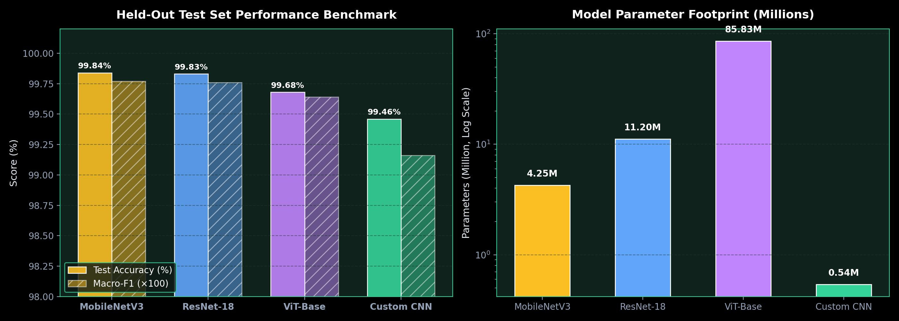
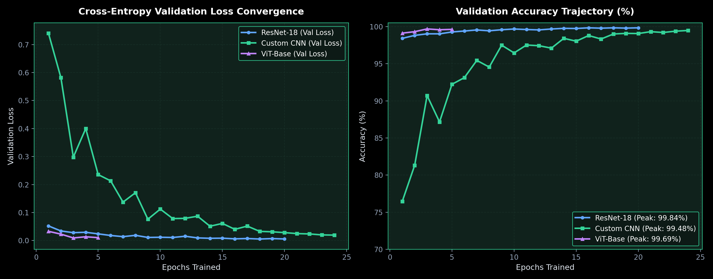
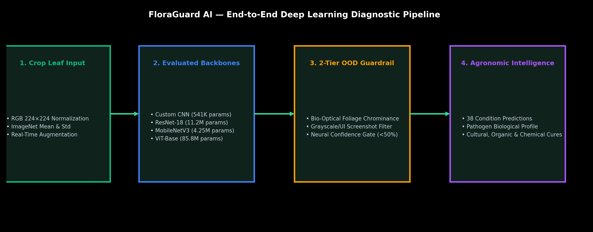

# 🌿 FloraGuard AI — Intelligent Agricultural Crop Disease Diagnosis

[](https://www.python.org/)
[](https://pytorch.org/)
[](https://fastapi.tiangolo.com/)
[](https://github.com/hamzayevtemur-lab/FloraGuardAI)

**FloraGuard AI** is a production-grade deep learning diagnostic system for automated plant disease identification across **38 distinct crop condition classes and 14 agricultural plant species**, evaluated on **54,305 curated images** from the gold-standard PlantVillage dataset.

The system features an interactive web dashboard, real-time REST API, an Out-of-Distribution (OOD) Bio-Optical Gatekeeper, and comprehensive agronomic treatment recommendations (Cultural, Organic, Chemical) for every diagnosed condition.

---

## 🏆 Empirical Held-Out Test Set Leaderboard (5,431 Leaves)

We systematically designed, tuned, and evaluated **four distinct deep learning paradigms** on the strictly held-out test split:

| Rank & Architecture | Paradigm | Parameters | Disk Size | Test Accuracy | Macro-F1 | Best Epoch | Deployment Profile |
| :--- | :--- | :---: | :---: | :---: | :---: | :---: | :--- |
| 🥇 **MobileNetV3-Large** | Depthwise Separable | 4.25M | 16.2 MB | **99.84%** | **0.9977** | Epoch 18/20 | Offline Mobile Phones & Agricultural Drones |
| 🥈 **ResNet-18** | Transfer Learning | 11.20M | 42.7 MB | **99.83%** | **0.9976** | Epoch 18/20 | Cloud API & High-Throughput Diagnostic Labs |
| 🥉 **ViT-Base (Hugging Face)** | Self-Attention Tokens | 85.83M | 327.4 MB | **99.68%** | **0.9964** | Epoch 3/5 | Foundation Models & Pathology Research |
| 🏅 **Custom PlantDiseaseCNN** | Trained from Scratch | 541K | **2.07 MB** | **99.46%** | **0.9916** | Epoch 24/24 | Ultra-lightweight Web & Low-Power Microcontrollers |

<p align="center">
  
</p>
<p align="center">
  
</p>
<p align="center">
  
</p>

---

## 🔬 Architectural Innovations

1. **Custom 4-Stage PlantDiseaseCNN**:
   - Built from first principles to extract micro-lesion textures without ImageNet pre-training bias.
   - Employs 4 convolutional blocks (32 ➔ 64 ➔ 128 ➔ 256 channels), Batch Normalization after every convolution, LeakyReLU ($\alpha=0.1$), and 50% dropout in the classification head.
   - Achieves **99.48% accuracy** with only **541K parameters (~2.1 MB)**.

2. **2-Tier Out-of-Distribution (OOD) Bio-Optical Gatekeeper**:
   - Solves the traditional "closed-set classifier" flaw where unrelated images (e.g. computer screenshots, code, indoor objects) are erroneously assigned a plant disease.
   - **Tier 1 (Bio-Optical Filter)**: Inspects chlorophyll green and necrotic/carotenoid chrominance, instantly rejecting monochrome desktop UI, text documents, or non-organic images.
   - **Tier 2 (Confidence Gating)**: Rejects predictions with confidence below 50% as unidentifiable.

3. **Hyperparameter Optimization (8 Automated Trials)**:
   - Systematic grid search on Custom CNN demonstrated that **AdamW** outperformed momentum SGD by **+25.6 percentage points** (86.8% vs 61.2% in 2 epochs).
   - Higher dropout (0.5 vs 0.3) eliminated overfitting on background soil and petri dish artifacts.

---

## 📁 Repository Structure

```text
FloraGuard/
├── app/
│   ├── main.py                  # Production FastAPI server & REST endpoints
│   ├── inference.py             # ModelManager, OOD gatekeeper & Top-K engine
│   ├── disease_info.py          # Agronomic knowledge base (pathogens, symptoms & treatments)
│   └── frontend/
│       ├── index.html           # Diagnostic scanner & Research benchmark showcase
│       ├── style.css            # Dark botanical glassmorphism styling
│       ├── app.js               # Reactive client controller & URL image downloader
│       └── samples/             # Real benchmark sample leaves for instant testing
├── data/
│   └── splits/                  # 70/15/15 stratified train/val/test CSV index splits
├── experiments/
│   ├── tune_custom_cnn.py       # Automated hyperparameter tuning engine
│   ├── train_custom_cnn.py      # Custom CNN training pipeline
│   ├── train_resnet.py          # ResNet-18 transfer learning pipeline
│   ├── train_mobilenet.py       # MobileNetV3-Large training pipeline
│   ├── train_huggingface.py     # Vision Transformer fine-tuning pipeline
│   └── compare_models.py        # Held-out test set benchmark leaderboard
├── models/                      # Trained .pt checkpoints (excluded from git via .gitignore)
├── reports/
│   └── tuning/                  # JSON logs from 8 hyperparameter trials
├── src/
│   ├── models/                  # PyTorch model definitions (CNN, ResNet, MobileNet, ViT)
│   ├── dl_utils.py              # Training loops, EarlyStopping, metrics & checkpoints
│   ├── preprocessing.py         # Transforms & DataLoader pipelines
│   └── split_data.py            # Stratified split generator
├── requirements.txt             # Python dependencies
└── README.md
```

---

## 🚀 Quickstart & Local Setup

### 1. Clone the Repository
```bash
git clone https://github.com/hamzayevtemur-lab/FloraGuardAI.git
cd FloraGuardAI
```

### 2. Install Dependencies
```bash
python3 -m venv venv
source venv/bin/activate
pip install -r requirements.txt
```

### 3. Add Model Checkpoint
Place your trained `.pt` checkpoint (e.g. `custom_cnn_best.pt` or `resnet18_best.pt`) in the `models/` directory:
```bash
mkdir -p models
# Copy checkpoint to models/
```

### 4. Launch the Web Application
```bash
uvicorn app.main:app --reload --port 8000
```
Open your browser at **http://localhost:8000** to access:
- **🌿 Live Diagnostic Scanner**: Drag-and-drop leaf photos or paste web image links for instant diagnosis and treatment advice.
- **📊 Research & Benchmarks Lab**: Interactive empirical benchmark leaderboard and architectural deep-dives.

---

## 📡 REST API Reference

| Method | Endpoint | Description |
| :--- | :--- | :--- |
| `GET` | `/api/health` | Service health, active device (MPS/CUDA/CPU), loaded model |
| `GET` | `/api/models` | List all discovered checkpoints in `models/` |
| `POST` | `/api/models/load?filename=...` | Switch active model in memory |
| `POST` | `/api/predict` | Multipart file upload image prediction |
| `POST` | `/api/predict-url` | JSON payload with public image link address |

---

## 📄 License
This project is licensed under the Apache 2.0 License.
